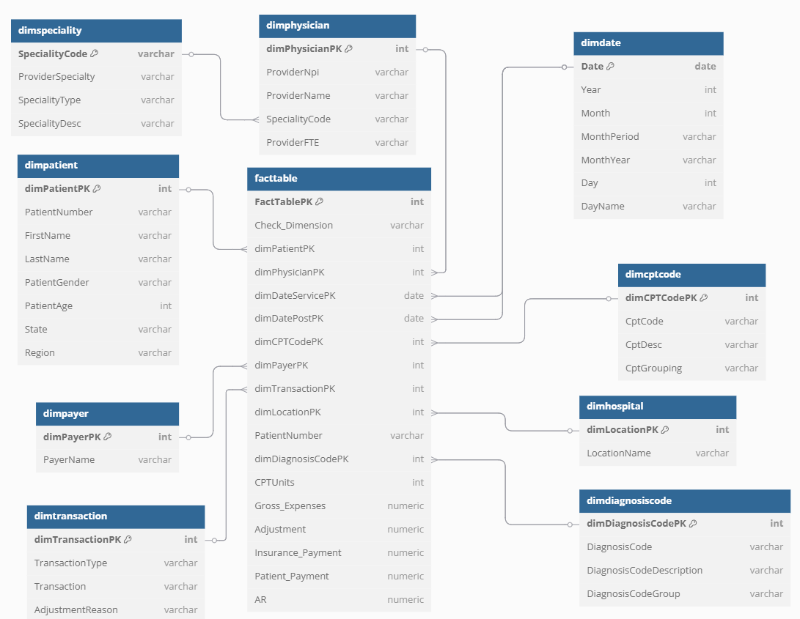

# 🏥 US Healthcare SQL Analytics Project

A complete end-to-end healthcare analytics project using **PostgreSQL**, **pgAdmin**, and **Python** to extract actionable insights from claims and patient data.

---

## 📁 Folder Structure

  
📁 <strong>us_healthcare_sql_analysis/</strong> – Click to expand

📂 data/  
├── 📄 datasets/ – Raw CSV files  
├── 📄 outputs/ – Cleaned data using pandas  

📂 database/  
├── 📜 Defining_Tables.sql – PostgreSQL table schema  
├── 🐍 Load_Data_Scripts.py – Bulk load via psycopg2  

📂 notebooks/  
├── 📓 1_data_cleaning.ipynb – Clean and export CSVs  
├── 📓 2_eda_analysis.ipynb – Nulls, value distribution  
├── 📓 3_sql_query_runner.ipynb – Run SQL and export results  

📂 business_problems_outcomes/  
├── 🧠 01_top_cpt_costs.sql  
├── 🧠 02_avg_insurance_coverage.sql  
├── … (20 KPI queries)  
├── 📄 result_01_top_cpt_costs.csv – pgAdmin query outputs  

📂 outputs/  
├── 📄 csvs/ – Python-executed SQL output files  

📂 diagrams/  
├── 🖼️ ERD_Health_Analytics.png – ER diagram  

📘 README.md – This file  

---

## 🧰 Tools & Technologies Used

| Tool           | Purpose                             |
|----------------|-------------------------------------|
| PostgreSQL     | Backend relational database         |
| pgAdmin 4      | SQL execution & schema inspection   |
| Python (pandas)| Cleaning raw data and automation    |
| Jupyter        | EDA and automation notebooks        |
| SQL            | Core logic to extract insights      |

---

## 🧼 Step 1: Data Cleaning (`1_data_cleaning.ipynb`)

- Loaded all raw `.csv` files from `data/datasets/`
- Standardized column names (underscores)
- Filled missing values with `"NA"`
- Fixed bad dates (e.g., `16-12-2019`) and numeric errors (`#NUM!`)
- Saved cleaned files to `data/outputs/`

---

## 📊 Step 2: Exploratory Analysis (`2_eda_analysis.ipynb`)

- Null value summary
- Unique count checks for ID columns
- Gender, state, and payer distribution plots
- Verified foreign key relations across tables

---

## 🗃️ Step 3: PostgreSQL Database Setup

- **File:** `database/Defining_Tables.sql`  
  Created tables with constraints and relations between fact and dimension tables.

- **File:** `database/Load_Data_Scripts.py`  
  Loaded cleaned `.csv` files into PostgreSQL using `psycopg2` with status logging.

---

## 🧠 Step 4: Business Problem KPIs

20 real-time healthcare business KPIs have been solved using SQL and stored inside:

- `business_problems_outcomes/` → SQL query files  
- `business_problems_outcomes/` → Results via **pgAdmin**
- `outputs/csvs/` → Results via **Python notebook**

Each KPI includes:
- Clear objective
- SQL logic
- Output CSV from both sources

| KPI No. | KPI Title                                      | Objective                                                                 | SQL Query File                                                                                  | CSV via pgAdmin                                                                                      | CSV via Python                                                                                     |
|--------:|------------------------------------------------|---------------------------------------------------------------------------|--------------------------------------------------------------------------------------------------|--------------------------------------------------------------------------------------------------------|----------------------------------------------------------------------------------------------------|
| 1       | Top CPT Codes by Total Expenses                | Identify high-cost services and their contribution                        | [01_top_cpt_costs.sql](business_problems_outcomes/01_top_cpt_costs.sql)                         | [result_01_top_cpt_costs.csv](business_problems_outcomes/result_01_top_cpt_costs.csv)           | [result_01_top_cpt_costs.csv](outputs/csvs/result_01_top_cpt_costs.csv)                           |
| 2       | Avg Insurance Payment by Payer                 | Track average insurance payments and coverage %                           | [02_avg_insurance_coverage.sql](business_problems_outcomes/02_avg_insurance_coverage.sql)       | [result_02_avg_insurance_coverage.csv](business_problems_outcomes/result_02_avg_insurance_coverage.csv) | [result_02_avg_insurance_coverage.csv](outputs/csvs/result_02_avg_insurance_coverage.csv)         |
| 3       | Insurance vs Out-of-Pocket Ratio              | Understand cost split between insurance and patients                      | [03_oop_ratio.sql](business_problems_outcomes/03_oop_ratio.sql)                                 | [result_03_oop_ratio.csv](business_problems_outcomes/result_03_oop_ratio.csv)                   | [result_03_oop_ratio.csv](outputs/csvs/result_03_oop_ratio.csv)                                   |
| 4       | Patients Without Insurance Payment             | Count self-pay cases and % out-of-pocket                                  | [04_uninsured_cases.sql](business_problems_outcomes/04_uninsured_cases.sql)                     | [result_04_uninsured_cases.csv](business_problems_outcomes/result_04_uninsured_cases.csv)       | [result_04_uninsured_cases.csv](outputs/csvs/result_04_uninsured_cases.csv)                       |
| 5       | Payers with Most Claims but Least Payment      | Detect low-paying high-claim insurers                                    | [05_low_paying_payers.sql](business_problems_outcomes/05_low_paying_payers.sql)                 | [result_05_low_paying_payers.csv](business_problems_outcomes/result_05_low_paying_payers.csv)   | [result_05_low_paying_payers.csv](outputs/csvs/result_05_low_paying_payers.csv)                   |
| 6       | Avg Patient Payment by State                   | Patient out-of-pocket average by geography                                | [06_avg_patient_payment_state.sql](business_problems_outcomes/06_avg_patient_payment_state.sql) | [result_06_avg_patient_payment_state.csv](business_problems_outcomes/result_06_avg_patient_payment_state.csv) | [result_06_avg_patient_payment_state.csv](outputs/csvs/result_06_avg_patient_payment_state.csv)   |
| 7       | Avg Claim Cost by Gender                       | Understand cost difference across genders                                 | [07_avg_cost_gender.sql](business_problems_outcomes/07_avg_cost_gender.sql)                     | [result_07_avg_cost_gender.csv](business_problems_outcomes/result_07_avg_cost_gender.csv)       | [result_07_avg_cost_gender.csv](outputs/csvs/result_07_avg_cost_gender.csv)                       |
| 8       | Top 5 States by OOP %                          | Find states with highest out-of-pocket burden                             | [08_top_oop_states.sql](business_problems_outcomes/08_top_oop_states.sql)                       | [result_08_top_oop_states.csv](business_problems_outcomes/result_08_top_oop_states.csv)         | [result_08_top_oop_states.csv](outputs/csvs/result_08_top_oop_states.csv)                         |
| 9       | Readmission Detection                          | Track multiple hospital visits per patient                                | [09_readmissions.sql](business_problems_outcomes/09_readmissions.sql)                           | [result_09_readmissions.csv](business_problems_outcomes/result_09_readmissions.csv)             | [result_09_readmissions.csv](outputs/csvs/result_09_readmissions.csv)                             |
| 10      | Monthly Claim Trend                            | Observe claim trends over time                                            | [10_monthly_claim_trend.sql](business_problems_outcomes/10_monthly_claim_trend.sql)             | [result_10_monthly_claim_trend.csv](business_problems_outcomes/result_10_monthly_claim_trend.csv) | [result_10_monthly_claim_trend.csv](outputs/csvs/result_10_monthly_claim_trend.csv)               |
| 11      | Physician Efficiency (Cost/Patient)            | Measure cost-efficiency per physician                                     | [11_physician_efficiency.sql](business_problems_outcomes/11_physician_efficiency.sql)           | [result_11_physician_efficiency.csv](business_problems_outcomes/result_11_physician_efficiency.csv) | [result_11_physician_efficiency.csv](outputs/csvs/result_11_physician_efficiency.csv)             |
| 12      | Claim Volume by Specialty                      | Analyze claim frequency by medical specialty                              | [12_claim_volume_specialty.sql](business_problems_outcomes/12_claim_volume_specialty.sql)       | [result_12_claim_volume_specialty.csv](business_problems_outcomes/result_12_claim_volume_specialty.csv) | [result_12_claim_volume_specialty.csv](outputs/csvs/result_12_claim_volume_specialty.csv)         |
| 13      | Top 5 Expensive Specialties                    | Identify costly specialties in terms of expenses                          | [13_top_expensive_specialties.sql](business_problems_outcomes/13_top_expensive_specialties.sql) | [result_13_top_expensive_specialties.csv](business_problems_outcomes/result_13_top_expensive_specialties.csv) | [result_13_top_expensive_specialties.csv](outputs/csvs/result_13_top_expensive_specialties.csv)   |
| 14      | Diagnosis Groups by Volume + Avg AR            | Rank diagnosis groups and their avg AR                                    | [14_diagnosis_claims_ar.sql](business_problems_outcomes/14_diagnosis_claims_ar.sql)             | [result_14_diagnosis_claims_ar.csv](business_problems_outcomes/result_14_diagnosis_claims_ar.csv) | [result_14_diagnosis_claims_ar.csv](outputs/csvs/result_14_diagnosis_claims_ar.csv)               |
| 15      | Top 10 Diagnosis by AR                         | Identify diagnoses with highest average account receivable                | [15_top_diagnosis_ar.sql](business_problems_outcomes/15_top_diagnosis_ar.sql)                   | [result_15_top_diagnosis_ar.csv](business_problems_outcomes/result_15_top_diagnosis_ar.csv)     | [result_15_top_diagnosis_ar.csv](outputs/csvs/result_15_top_diagnosis_ar.csv)                     |
| 16      | Monthly Claims & Payout Trend                  | Track insurance and patient payment trend over months                     | [16_monthly_payout_trend.sql](business_problems_outcomes/16_monthly_payout_trend.sql)           | [result_16_monthly_payout_trend.csv](business_problems_outcomes/result_16_monthly_payout_trend.csv) | [result_16_monthly_payout_trend.csv](outputs/csvs/result_16_monthly_payout_trend.csv)             |
| 17      | Hospitals with Most Patients                   | Rank hospitals by patient volume and cost                                 | [17_top_hospitals.sql](business_problems_outcomes/17_top_hospitals.sql)                         | [result_17_top_hospitals.csv](business_problems_outcomes/result_17_top_hospitals.csv)           | [result_17_top_hospitals.csv](outputs/csvs/result_17_top_hospitals.csv)                           |
| 18      | Delayed Postings (Post > Service Date)         | Count late claim postings                                                 | [18_delayed_postings.sql](business_problems_outcomes/18_delayed_postings.sql)                   | [result_18_delayed_postings.csv](business_problems_outcomes/result_18_delayed_postings.csv)     | [result_18_delayed_postings.csv](outputs/csvs/result_18_delayed_postings.csv)                     |
| 19      | Avg CPT Units by Procedure Group               | Measure average units used per CPT group                                  | [19_avg_cpt_units.sql](business_problems_outcomes/19_avg_cpt_units.sql)                         | [result_19_avg_cpt_units.csv](business_problems_outcomes/result_19_avg_cpt_units.csv)           | [result_19_avg_cpt_units.csv](outputs/csvs/result_19_avg_cpt_units.csv)                           |
| 20      | Diagnosis with Most Adjustments                | See which diagnoses are most adjusted in billing                          | [20_diagnosis_adjustments.sql](business_problems_outcomes/20_diagnosis_adjustments.sql)         | [result_20_diagnosis_adjustments.csv](business_problems_outcomes/result_20_diagnosis_adjustments.csv) | [result_20_diagnosis_adjustments.csv](outputs/csvs/result_20_diagnosis_adjustments.csv)           |

---

## 🧪 Step 5: Run SQL Queries with Python

Notebook: [`3_sql_query_runner.ipynb`](notebooks/3_sql_query_runner.ipynb)

- Reads all `.sql` files in `business_problems_outcomes/`
- Connects to PostgreSQL database
- Executes each query dynamically
- Saves output result as `.csv` into `outputs/csvs/`

---

## 🔗 Entity Relationship Diagram

- **Fact table**: `facttable`
- **Linked dimensions**: `dimpatient`, `dimpayer`, `dimphysician`, `dimdate`, etc.
- Built using [dbdiagram.io](https://dbdiagram.io) > *ERD Tool*

---

## 📬 Summary

This project demonstrates **end-to-end healthcare analytics** using:

- ✅ PostgreSQL schema with relationships and indexing
- ✅ SQL queries solving real-world business KPIs
- ✅ Python (`psycopg2`, `pandas`) for query automation
- ✅ Jupyter notebooks for data cleaning and exploration
- ✅ Full insight generation across cost, coverage, efficiency, and delays

---

## 🚀 Run It Yourself

1. **Load Data to PostgreSQL**  
   Run: `python database/Load_Data_Scripts.py`

2. **Run KPIs**  
   Use either:
   - SQL in **pgAdmin** (manually)
   - Notebook: [`3_sql_query_runner.ipynb`](notebooks/3_sql_query_runner.ipynb)

3. **Check Results**  
   Output `.csv` files are saved in:
   - `business_problems_outcomes/` → via **pgAdmin**
   - `outputs/csvs/` → via **Python script**

---

## 📩 Contact

For questions or collaboration, feel free to connect:

- 💼 LinkedIn: [Harish Chowdary](https://www.linkedin.com/in/harish-chowdary)
- 🧑‍💻 GitHub: [Harish-34](https://github.com/Harish-34)

### 🔍 Business KPI 1: Top CPT Codes by Total Expenses

**Objective:**  
Identify high-cost medical procedures based on total expense, average cost per unit, and cost contribution to overall healthcare spending.

**SQL File:**  
[business_problems_outcomes/01_top_cpt_costs.sql](business_problems_outcomes/01_top_cpt_costs.sql)

**Result CSV:**  
[business_problems_outcomes/result_01_top_cpt_costs.csv](business_problems_outcomes/result_01_top_cpt_costs.csv)

### 🔍 Business KPI 2: Avg Insurance Payment + Coverage % by Payer

**Objective:**  
Evaluate how much insurance companies are paying on average and how much of the treatment cost they cover.

**SQL File:**  
[business_problems_outcomes/02_avg_insurance_coverage.sql](business_problems_outcomes/02_avg_insurance_coverage.sql)

**Result CSV:**  
[business_problems_outcomes/result_02_avg_insurance_coverage.csv](business_problems_outcomes/result_02_avg_insurance_coverage.csv)

### 🔍 Business KPI 3: Insurance vs Out-of-Pocket Ratio

**Objective:**  
Compare total insurance contributions to what patients are paying out-of-pocket to understand cost burden.

**SQL File:**  
[business_problems_outcomes/03_insurance_vs_oop_ratio.sql](business_problems_outcomes/03_insurance_vs_oop_ratio.sql)

**Result CSV:**  
[business_problems_outcomes/result_03_insurance_vs_oop_ratio.csv](business_problems_outcomes/result_03_insurance_vs_oop_ratio.csv)

### 🔍 Business KPI 4: Patients Without Insurance Payment

**Objective:**  
Calculate how many healthcare claims had zero insurance coverage and determine how much of the total cost was paid out-of-pocket by patients.

**SQL File:**  
[business_problems_outcomes/04_patients_without_insurance.sql](business_problems_outcomes/04_patients_without_insurance.sql)

**Result CSV:**  
[business_problems_outcomes/result_04_patients_without_insurance.csv](business_problems_outcomes/result_04_patients_without_insurance.csv)

### 🔍 Business KPI 5: Payers with Most Claims but Least Payment

**Objective:**  
Spot payers that process the highest volume of claims but contribute the least in terms of insurance payouts.

**SQL File:**  
[business_problems_outcomes/05_payers_most_claims_least_payment.sql](business_problems_outcomes/05_payers_most_claims_least_payment.sql)

**Result CSV:**  
[business_problems_outcomes/result_05_payers_most_claims_least_payment.csv](business_problems_outcomes/result_05_payers_most_claims_least_payment.csv)

### 🔍 Business KPI 6: Avg Patient Payment by State

**Objective:**  
Evaluate how average out-of-pocket payments vary by state to detect regional financial trends and affordability issues.

**SQL File:**  
[business_problems_outcomes/06_avg_patient_payment_by_state.sql](business_problems_outcomes/06_avg_patient_payment_by_state.sql)

**Result CSV:**  
[business_problems_outcomes/result_06_avg_patient_payment_by_state.csv](business_problems_outcomes/result_06_avg_patient_payment_by_state.csv)

### 🔍 Business KPI 7: Avg Claim Cost by Gender

**Objective:**  
Identify any cost variation in healthcare claims between different gender groups, helping highlight potential inequalities or risk trends.

**SQL File:**  
[business_problems_outcomes/07_avg_claim_cost_by_gender.sql](business_problems_outcomes/07_avg_claim_cost_by_gender.sql)

**Result CSV:**  
[business_problems_outcomes/result_07_avg_claim_cost_by_gender.csv](business_problems_outcomes/result_07_avg_claim_cost_by_gender.csv)

### 🔍 Business KPI 8: Top 5 States by Out-of-Pocket %

**Objective:**  
Identify states where patients bear the highest percentage of healthcare costs, indicating regions with higher out-of-pocket burdens.

**SQL File:**  
[business_problems_outcomes/08_top_states_by_oop_percent.sql](business_problems_outcomes/08_top_states_by_oop_percent.sql)

**Result CSV:**  
[business_problems_outcomes/result_08_top_states_by_oop_percent.csv](business_problems_outcomes/result_08_top_states_by_oop_percent.csv)

### 🔍 Business KPI 9: Readmission Detection (Multiple Visits)

**Objective:**  
Detect patients with multiple visits to assess potential readmission patterns, which may signal chronic issues or care gaps.

**SQL File:**  
[business_problems_outcomes/09_readmission_detection.sql](business_problems_outcomes/09_readmission_detection.sql)

**Result CSV:**  
[business_problems_outcomes/result_09_readmission_detection.csv](business_problems_outcomes/result_09_readmission_detection.csv)

### 🔍 Business KPI 10: Monthly Claim Trend

**Objective:**  
Analyze how healthcare claim volumes and expenses change over time, month by month.

**SQL File:**  
[business_problems_outcomes/10_monthly_claim_trend.sql](business_problems_outcomes/10_monthly_claim_trend.sql)

**Result CSV:**  
[business_problems_outcomes/result_10_monthly_claim_trend.csv](business_problems_outcomes/result_10_monthly_claim_trend.csv)

### 🔍 Business KPI 11: Physician Efficiency (Cost per Patient)

**Objective:**  
Determine cost effectiveness of physicians based on how much is spent per patient treated.

**SQL File:**  
[business_problems_outcomes/11_physician_cost_efficiency.sql](business_problems_outcomes/11_physician_cost_efficiency.sql)

**Result CSV:**  
[business_problems_outcomes/result_11_physician_cost_efficiency.csv](business_problems_outcomes/result_11_physician_cost_efficiency.csv)

### 🔍 Business KPI 12: Claim Volume by Specialty

**Objective:**  
Track how many claims are submitted under each physician specialty to understand workload and demand.

**SQL File:**  
[business_problems_outcomes/12_claim_volume_by_specialty.sql](business_problems_outcomes/12_claim_volume_by_specialty.sql)

**Result CSV:**  
[business_problems_outcomes/result_12_claim_volume_by_specialty.csv](business_problems_outcomes/result_12_claim_volume_by_specialty.csv)

### 🔍 Business KPI 13: Top 5 Expensive Specialties

**Objective:**  
Identify the top medical specialties that account for the highest total gross healthcare expenses.

**SQL File:**  
[business_problems_outcomes/13_top_expensive_specialties.sql](business_problems_outcomes/13_top_expensive_specialties.sql)

**Result CSV:**  
[business_problems_outcomes/result_13_top_expensive_specialties.csv](business_problems_outcomes/result_13_top_expensive_specialties.csv)

### 🔍 Business KPI 14: Diagnosis Groups by Claim Volume + Avg AR

**Objective:**  
Analyze which diagnosis groups are most frequently claimed and observe their average AR levels for payment risk profiling.

**SQL File:**  
[business_problems_outcomes/14_diagnosis_claim_volume_avg_ar.sql](business_problems_outcomes/14_diagnosis_claim_volume_avg_ar.sql)

**Result CSV:**  
[business_problems_outcomes/result_14_diagnosis_claim_volume_avg_ar.csv](business_problems_outcomes/result_14_diagnosis_claim_volume_avg_ar.csv)

### 🔍 Business KPI 15: Top 10 Diagnosis by Highest AR

**Objective:**  
Identify diagnosis groups that are associated with the highest average AR (Accounts Receivable), which helps in recognizing categories with slower or riskier payments.

**SQL File:**  
[business_problems_outcomes/15_top_diagnosis_by_highest_ar.sql](business_problems_outcomes/15_top_diagnosis_by_highest_ar.sql)

**Result CSV:**  
[business_problems_outcomes/result_15_top_diagnosis_by_highest_ar.csv](business_problems_outcomes/result_15_top_diagnosis_by_highest_ar.csv)

### 🔍 Business KPI 16: Monthly Claims & Payout Trend

**Objective:**  
Track monthly trends in total claim submissions and payouts (combined insurance and patient payments) to evaluate seasonal patterns and financial performance.

**SQL File:**  
[business_problems_outcomes/16_monthly_claims_payout_trend.sql](business_problems_outcomes/16_monthly_claims_payout_trend.sql)

**Result CSV:**  
[business_problems_outcomes/result_16_monthly_claims_payout_trend.csv](business_problems_outcomes/result_16_monthly_claims_payout_trend.csv)

### 🔍 Business KPI 17: Hospitals with Highest Patients

**Objective:**  
Identify which hospitals are handling the largest patient volumes and evaluate their contribution to total healthcare expenses.

**SQL File:**  
[business_problems_outcomes/17_top_hospitals_by_patients.sql](business_problems_outcomes/17_top_hospitals_by_patients.sql)

**Result CSV:**  
[business_problems_outcomes/result_17_top_hospitals_by_patients.csv](business_problems_outcomes/result_17_top_hospitals_by_patients.csv)

### 🔍 Business KPI 18: Delayed Postings (Post > Service Date)

**Objective:**  
Identify how many claims were posted after the service date, which may indicate administrative inefficiencies or reporting lags.

**SQL File:**  
[business_problems_outcomes/18_delayed_postings_count.sql](business_problems_outcomes/18_delayed_postings_count.sql)

**Result CSV:**  
[business_problems_outcomes/result_18_delayed_postings_count.csv](business_problems_outcomes/result_18_delayed_postings_count.csv)

### 🔍 Business KPI 19: Avg CPT Units by Procedure Type

**Objective:**  
Analyze the average number of CPT units billed for each procedure grouping to identify services with higher operational demand.

**SQL File:**  
[business_problems_outcomes/19_avg_cpt_units_by_grouping.sql](business_problems_outcomes/19_avg_cpt_units_by_grouping.sql)

**Result CSV:**  
[business_problems_outcomes/result_19_avg_cpt_units_by_grouping.csv](business_problems_outcomes/result_19_avg_cpt_units_by_grouping.csv)

### 🔍 Business KPI 20: Diagnosis with Most Adjustments

**Objective:**  
Identify diagnosis categories with the highest total financial adjustments, which may signal frequent billing corrections, denials, or anomalies.

**SQL File:**  
[business_problems_outcomes/20_diagnosis_with_most_adjustments.sql](business_problems_outcomes/20_diagnosis_with_most_adjustments.sql)

**Result CSV:**  
[business_problems_outcomes/result_20_diagnosis_with_most_adjustments.csv](business_problems_outcomes/result_20_diagnosis_with_most_adjustments.csv)

